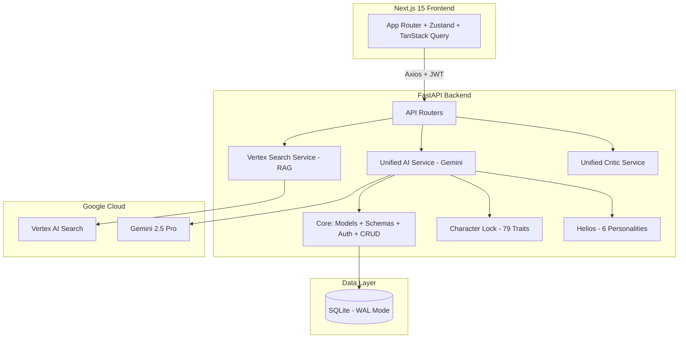

# AISpark Studio | AI Prompt Engineering & Character Consistency Engine

B2B API-first platform for AI-generated visual consistency. Character Lock system with 79 visual trait fields ensures characters stay consistent across unlimited generations. Helios engine blends 6 AI personalities for style-matched prompt output. Vertex AI RAG pipeline powered by 34 curated documents.


---

## Key Features

- **Character Lock** — 79 visual trait fields for cross-generation consistency
- **Helios Engine** — 6 AI personalities (Zeus, Athena, Apollo, Hermes, Artemis, Hephaestus) with algorithmic auto-blending
- **Critic Pipeline** — Self-critique scoring module that rates and improves prompt quality
- **RAG Pipeline** — Vertex AI Search over 34 curated creative documents
- **Multi-tenant B2B** — API key auth, tenant isolation, usage tracking

---

## Architecture



---

## Tech Stack

| Layer | Technology |
|---|---|
| Frontend | Next.js 15 (App Router), Tailwind CSS v4, Zustand, TanStack Query |
| Backend | FastAPI, Python 3.11+, Pydantic v2 |
| AI/ML | Gemini 2.5 Pro, Vertex AI Search, RAG Pipeline |
| Database | SQLAlchemy, SQLite (WAL mode) |
| Auth | JWT + OAuth2 Bearer, Multi-tenant API keys |

---

## Quick Start

### Prerequisites

- Python 3.11+
- Node.js 18+
- Google Cloud project with Vertex AI Search enabled
- Service account with `discoveryengine.viewer` role

### Backend Setup

```bash
cd backend
python -m venv venv
source venv/bin/activate        # Linux/macOS
venv\Scripts\activate           # Windows

pip install -r requirements.txt
cp .env.example .env            # Edit with your credentials
uvicorn main:app --reload --port 8001
```

Backend: `http://localhost:8001` | API Docs: `http://localhost:8001/docs`

### Frontend Setup

```bash
cd nextjs-frontend
npm install
cp .env.example .env.local      # Set NEXT_PUBLIC_API_URL=http://localhost:8001
npm run dev
```

Frontend: `http://localhost:3000`

---

## Project Structure

```
aispark-studio/
├── backend/
│   ├── main.py                        # App initialization, middleware, router registration
│   ├── config.py                      # Centralized settings (pydantic-settings)
│   ├── api/
│   │   ├── routers/                   # Domain-specific API routers
│   │   │   ├── auth_router.py         # Login, register, JWT
│   │   │   ├── generation_router.py   # Prompt generation, Helios auto-generate
│   │   │   ├── prompts_router.py      # Prompt CRUD, export
│   │   │   ├── characters_router.py   # Character Lock CRUD, sessions
│   │   │   ├── helios_router.py       # Personality selection & enhancement
│   │   │   ├── critic_router.py       # Prompt analysis & scoring
│   │   │   └── search_router.py       # Vertex AI Search
│   │   ├── v1/                        # B2B Sandbox API
│   │   └── v2/                        # B2B Admin & Core API
│   ├── core/
│   │   ├── models.py                  # SQLAlchemy ORM models
│   │   ├── schemas.py                 # Pydantic request/response schemas
│   │   ├── crud.py                    # Database operations
│   │   ├── auth.py                    # JWT authentication
│   │   ├── character_lock.py          # Character consistency system (79 traits)
│   │   └── helios_personalities.py    # 6 Helios creative personalities
│   ├── services/
│   │   ├── unified_ai_service.py      # Primary AI generation pipeline
│   │   ├── vertex_search_service.py   # Vertex AI Search (RAG)
│   │   ├── unified_critic_service.py  # Self-critique & refinement
│   │   ├── cache_service.py           # Response caching layer
│   │   └── export_service.py          # Multi-format export (JSON, CSV, TXT)
│   └── tests/                         # pytest suite
├── nextjs-frontend/                   # Next.js 15 (App Router)
├── knowledge_base/                    # Local RAG document fallback
├── docs/                              # Architecture documentation
├── LICENSE
├── CONTRIBUTING.md
└── README.md
```

---

## API Overview

| Group | Endpoints | Description |
|---|---|---|
| **Auth** | `POST /auth/token`, `POST /auth/register`, `GET /users/me` | JWT authentication |
| **Generation** | `POST /generate`, `POST /helios/auto-generate` | AI prompt generation with optional Helios personality |
| **Prompts** | `GET /prompts`, `GET /prompts/{id}`, `PUT .../favorite`, `DELETE`, `GET .../export/{format}` | Prompt CRUD and export |
| **Characters** | `POST /characters/create`, `GET /characters/list`, lock/unlock, stats | Character Lock system |
| **Helios** | `POST /helios/analyze`, `POST /helios/enhance`, `GET /helios/personalities` | Personality engine |
| **Critic** | `POST /critic/analyze`, `GET /critic/stats` | Prompt quality analysis |
| **Search** | `GET /search/vertex`, `GET /search/vertex/status` | Vertex AI Search (RAG) |
| **B2B Admin** | `POST /v2/admin/tenants`, API key management | Multi-tenant administration |
| **B2B Core** | `POST /v2/b2b/generate`, `POST /v2/b2b/critic/analyze` | Tenant-scoped generation |

Full interactive docs available at `/docs` (Swagger) and `/redoc` when the backend is running.

---

## Testing

```bash
# Backend
cd backend
python -m pytest tests/ -v
python -m pytest tests/ --cov=. --cov-report=html

# Frontend
cd nextjs-frontend
npm run lint
npm run test:e2e
```

---

## Roadmap

- [ ] SQLite to PostgreSQL migration with Alembic
- [ ] HttpOnly cookie auth (replace client-side JWT storage)
- [ ] Circuit breaker pattern for Vertex AI calls
- [ ] OpenAPI to TypeScript type generation (eliminate frontend type drift)
- [ ] Redis caching layer (replace in-memory cache)
- [ ] Docker containerization
- [ ] Frontend error boundaries

---

## Screenshots

> Screenshots coming soon. See [demo video](#) for a walkthrough.

---

## License

MIT License — see [LICENSE](LICENSE) for details.

---

Built by **Nick Bokuchava** — [LinkedIn](https://linkedin.com/in/nika-bokuchava-7856b03b5) · [GitHub](https://github.com/mindmnml-del)
