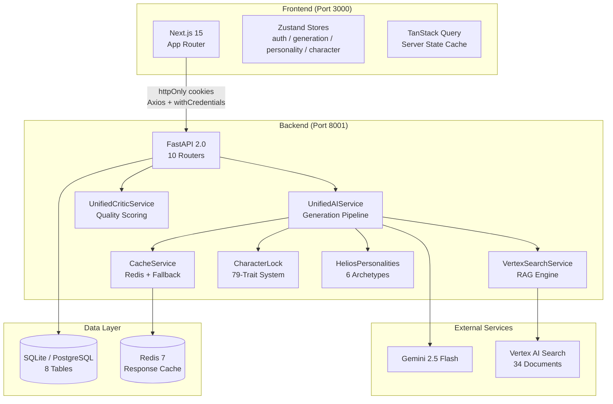
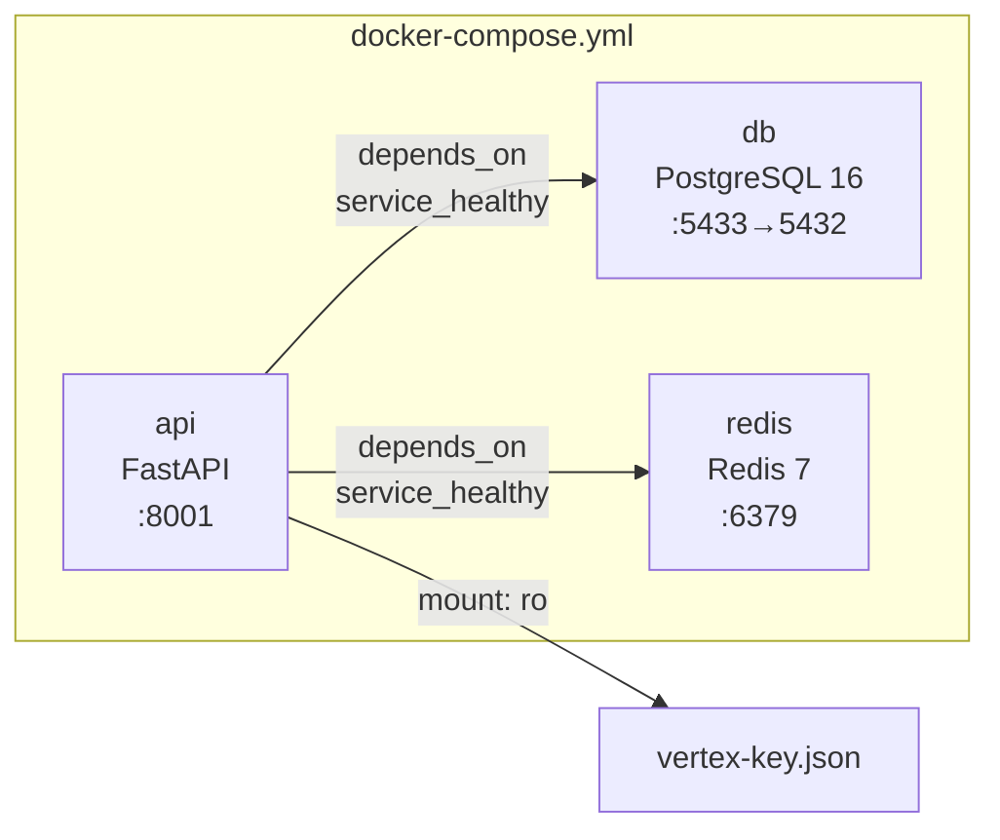
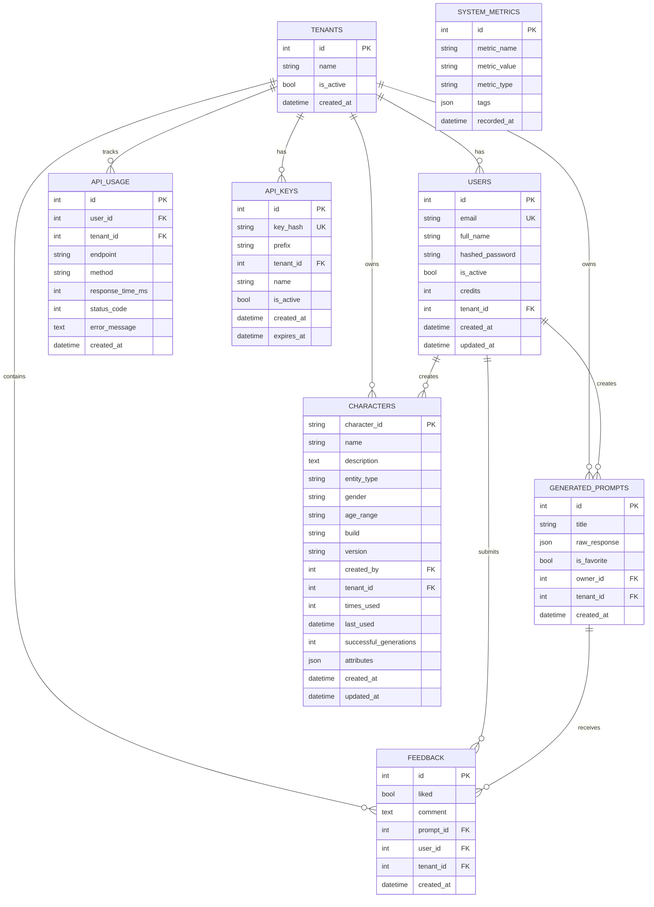
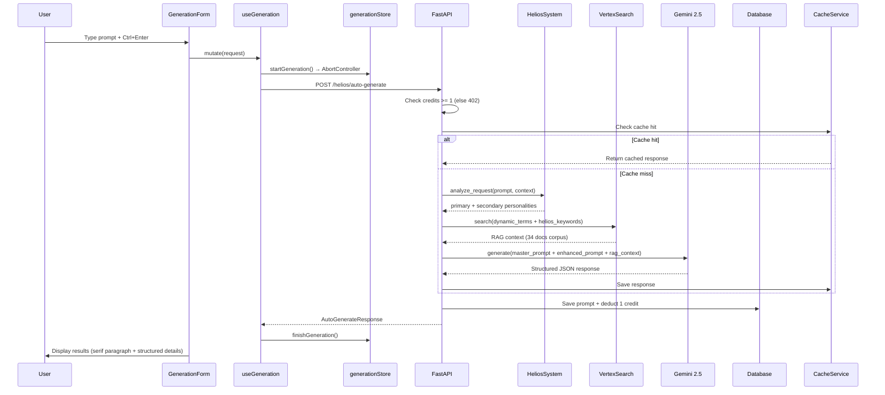
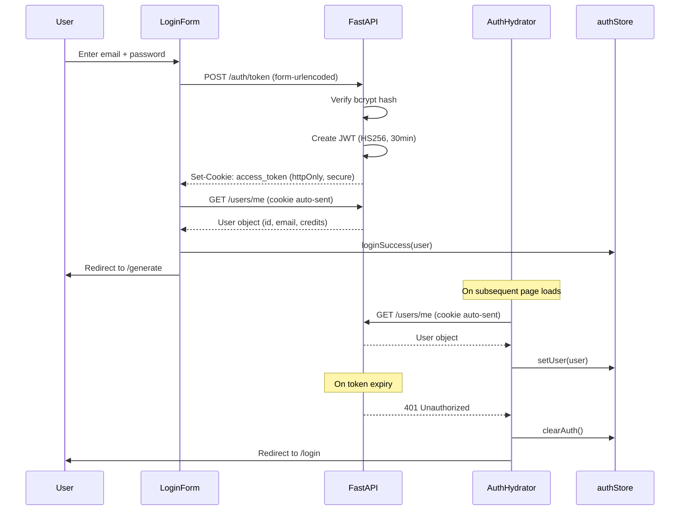
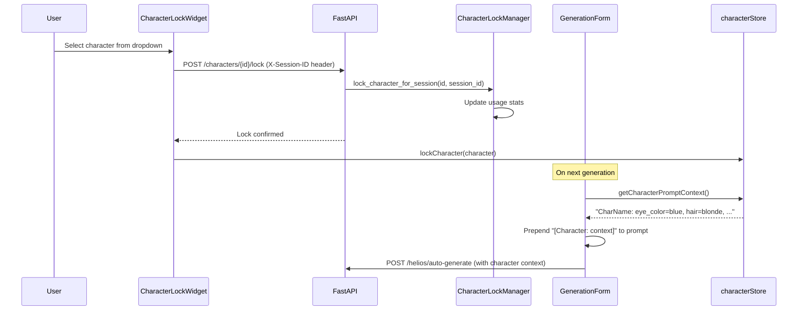
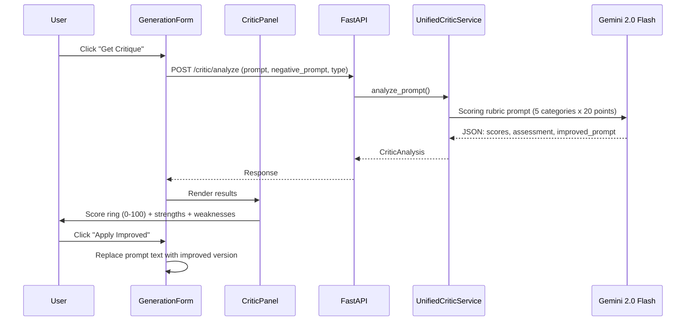

# AISpark Studio — Technical Architecture

> Definitive technical reference for the AISpark Studio platform.
> Last updated: 2026-03-18

---

## Table of Contents

1. [Executive Summary](#1-executive-summary)
2. [System Architecture](#2-system-architecture)
3. [Backend Architecture](#3-backend-architecture)
4. [Data Models](#4-data-models)
5. [Frontend Architecture](#5-frontend-architecture)
6. [Key System Flows](#6-key-system-flows)
7. [Configuration Reference](#7-configuration-reference)
8. [Deployment](#8-deployment)
9. [Security Model](#9-security-model)
10. [Testing](#10-testing)

---

## 1. Executive Summary

AISpark Studio is an AI-powered creative prompt engineering platform that combines Retrieval-Augmented Generation (RAG) with intelligent personality-driven enhancement to generate professional-grade prompts for image and video generation tools.

### What It Does

Users describe a creative vision in natural language. The system:
1. Selects the optimal **Helios personality** (from 6 creative archetypes) based on prompt analysis
2. Retrieves relevant knowledge from a **34-document corpus** via Vertex AI Search (RAG)
3. Generates a structured prompt using **Gemini 2.5 Flash**, enhanced with personality-specific language
4. Optionally locks a **Character Sheet** (79 visual traits) for visual consistency across generations
5. Scores prompt quality via a **self-critique system** (0-100 across 5 categories)

### Tech Stack

| Layer | Technology |
|-------|-----------|
| **Frontend** | Next.js 15.5.2, React 19, TypeScript, Tailwind CSS v4 |
| **Backend** | FastAPI 0.115+, Python 3.11+, SQLAlchemy 2.0 |
| **AI/ML** | Google Gemini 2.5 Flash, Vertex AI Search (Discovery Engine) |
| **Database** | SQLite (dev) / PostgreSQL 16 (prod) |
| **Cache** | Redis 7 with in-memory fallback |
| **State** | Zustand (client), TanStack Query (server) |
| **Auth** | JWT (HS256) + httpOnly cookies |
| **Deployment** | Docker Compose (3 services) |
| **CI** | GitHub Actions (lint, type-check, test, build) |

### Key Numbers

| Metric | Value |
|--------|-------|
| API endpoints | 40+ |
| Database tables | 8 |
| RAG documents | 34 |
| Helios personalities | 6 |
| Character traits | 79 |
| Critic scoring categories | 5 |
| Frontend components | 20+ |
| Zustand stores | 4 |
| Environment variables | 50+ |

---

## 2. System Architecture

### High-Level Topology



### Docker Compose Topology (Production)



---

## 3. Backend Architecture

### 3.1 Application Startup

**Entry point:** `backend/main.py`

```
1. FastAPI(title="AISpark Studio API", version="2.0.0", lifespan=lifespan)
2. Lifespan startup:
   a. Alembic migrations → upgrade to "head"
   b. cache_service.initialize() → Redis connection or fallback
   c. ai_service.ensure_ready() → Load master prompt, init RAG
3. CORS middleware (configurable origins, credentials=True)
4. Register 7 domain routers + 3 B2B routers
5. System endpoints: GET / (info), GET /health
```

**Router registration order:**
1. `auth_router` — Authentication
2. `generation_router` — AI generation
3. `prompts_router` — Prompt CRUD
4. `characters_router` — Character Lock
5. `helios_router` — Personality engine
6. `critic_router` — Quality analysis
7. `search_router` — Vertex AI Search
8. `sandbox_router` → `/v1/sandbox` — B2B Sandbox
9. `admin_router` → `/v2/admin` — B2B Admin
10. `b2b_router` → `/v2/b2b` — B2B Core

### 3.2 API Endpoint Map

#### Authentication (`auth_router`)

| Method | Path | Auth | Description |
|--------|------|------|-------------|
| POST | `/auth/token` | Public | Login (OAuth2 form), sets httpOnly cookie |
| POST | `/auth/register` | Public | Register new user (3 free credits) |
| POST | `/auth/logout` | Cookie | Clear session cookie |
| GET | `/users/me` | Cookie | Get current user profile |

#### Generation (`generation_router`)

| Method | Path | Auth | Description |
|--------|------|------|-------------|
| POST | `/generate` | Cookie | Generate prompt (legacy endpoint) |
| POST | `/helios/auto-generate` | Cookie | Auto-select personality + generate (primary endpoint) |

#### Prompts (`prompts_router`)

| Method | Path | Auth | Description |
|--------|------|------|-------------|
| GET | `/prompts` | Cookie | List prompts (paginated: skip, limit, favorites_only) |
| GET | `/prompts/{id}` | Cookie | Get full prompt with raw_response + feedback |
| PUT | `/prompts/{id}/favorite` | Cookie | Toggle favorite status |
| DELETE | `/prompts/{id}` | Cookie | Delete prompt |
| GET | `/prompts/export/{format}` | Cookie | Export prompts (json, csv, txt) |

#### Characters (`characters_router`)

| Method | Path | Auth | Description |
|--------|------|------|-------------|
| POST | `/characters/create` | Cookie | Create character (79 traits) |
| GET | `/characters/list` | Cookie | List all user's characters |
| GET | `/characters/{id}` | Cookie | Get character details |
| PUT | `/characters/{id}` | Cookie | Update character traits |
| DELETE | `/characters/{id}` | Cookie | Delete character |
| POST | `/characters/{id}/lock` | Cookie + X-Session-ID | Lock character for session |
| DELETE | `/characters/unlock` | Cookie + X-Session-ID | Release session lock |
| GET | `/characters/session/current` | Cookie + X-Session-ID | Get locked character |
| GET | `/characters/stats` | Cookie | Character usage statistics |
| POST | `/characters/extract-from-prompt` | Cookie | AI-extract traits from text |

#### Helios Personalities (`helios_router`)

| Method | Path | Auth | Description |
|--------|------|------|-------------|
| POST | `/helios/analyze` | Cookie | Analyze request, select personalities |
| POST | `/helios/enhance` | Cookie | Enhance prompt with personality |
| GET | `/helios/personalities` | Cookie | List all 6 personalities |
| GET | `/helios/personality/{name}` | Cookie | Get personality profile |
| GET | `/helios/stats` | Cookie | Selection statistics |

#### Critic (`critic_router`)

| Method | Path | Auth | Description |
|--------|------|------|-------------|
| POST | `/critic/analyze` | Cookie | Score prompt quality (0-100) |
| GET | `/critic/stats` | Cookie | Service statistics |

#### Search (`search_router`)

| Method | Path | Auth | Description |
|--------|------|------|-------------|
| GET | `/search/vertex` | Cookie | Search knowledge base (RAG) |
| GET | `/search/vertex/status` | Cookie | Service status |

#### B2B Sandbox (`/v1/sandbox`)

| Method | Path | Auth | Description |
|--------|------|------|-------------|
| POST | `/v1/sandbox/generate` | Bearer token | Generate prompt |
| POST | `/v1/sandbox/critic/analyze` | Bearer token | Analyze prompt |

#### B2B Admin (`/v2/admin`)

| Method | Path | Auth | Description |
|--------|------|------|-------------|
| POST | `/v2/admin/tenants` | Bearer token | Create tenant |
| POST | `/v2/admin/tenants/{id}/api-keys` | Bearer token | Generate API key |
| GET | `/v2/admin/tenants/{id}/api-keys` | Bearer token | List API keys |

#### B2B Core (`/v2/b2b`)

| Method | Path | Auth | Description |
|--------|------|------|-------------|
| POST | `/v2/b2b/generate` | X-API-Key | Generate prompt (usage tracked) |
| POST | `/v2/b2b/critic/analyze` | X-API-Key | Analyze prompt (usage tracked) |

#### System

| Method | Path | Auth | Description |
|--------|------|------|-------------|
| GET | `/` | Public | API info |
| GET | `/health` | Public | Health check |

### 3.3 Services

#### UnifiedAIService (`backend/services/unified_ai_service.py`)

Singleton service orchestrating the full generation pipeline.

**Generation pipeline (10 steps):**

```
1. Rate limiting          → _apply_rate_limiting()
2. Cache check            → _get_cache_key() → _get_from_cache()
3. Spark Shield           → _spark_shield_improve() [if auto_improve=true]
4. Helios selection       → _select_helios_personality() → signature_elements
5. RAG enhancement        → _enhance_with_rag_async() via Vertex AI Search
6. Prompt assembly        → master_prompt + base_prompt + rag_context
7. Gemini generation      → _generate_with_breaker() [circuit-protected]
8. Response processing    → Parse structured JSON from Gemini output
9. Diversity check        → _apply_diversity() [Jaccard similarity]
10. Cache save + return   → _save_to_cache() + metadata enrichment
```

**Key integration points:**
- **RAG**: `_extract_search_terms()` builds dynamic queries from user input + Helios keywords (up to 3 personality signature elements injected)
- **Helios**: `_select_helios_personality()` calls `helios_system.analyze_request()` → keyword scoring across 6 dimensions → selects primary + 2 secondary
- **Spark Shield**: Pre-generation critic that auto-improves prompts scoring below 80
- **Circuit Breaker**: `gemini_breaker` (3 failures → 60s open)

#### VertexSearchService (`backend/services/vertex_search_service.py`)

Google Cloud Discovery Engine integration for RAG.

- **Initialization**: Lazy-loaded, requires `vertex_search_enabled=true` + valid credentials
- **Query flow**: Build `SearchRequest` → `_execute_search()` (circuit-protected) → process results
- **Content fetch**: Multi-source — GCS buckets (.docx), Google Docs API, HTTP URLs
- **Circuit Breaker**: `vertex_search_breaker` (5 failures → 30s open)
- **Fallback**: Returns error dict (no crash) if breaker is open

#### CacheService (`backend/services/cache_service.py`)

Dual-mode caching with graceful degradation.

- **Primary**: Redis 7 with connection pooling (socket timeout 5s, health check every 30s)
- **Fallback**: In-memory dict with `(value, expiry_datetime)` tuples
- **Key format**: `{namespace}:v{version}:{key}` (default namespace: `ai_generation`)
- **TTL**: Configurable (default 1800s / 30 minutes)
- **Decorator**: `@cached(ttl, namespace, version)` for automatic cache-aside pattern
- **Metrics**: hits, misses, errors, fallback_hits, evictions

#### UnifiedCriticService (`backend/services/unified_critic_service.py`)

Prompt quality scoring via Gemini 2.0 Flash.

**Scoring rubric (0-100, five categories of 0-20 each):**

| Category (Photo) | Category (Video) | What It Measures |
|-------------------|-------------------|-----------------|
| CONCEPT_CONFLICT | TEMPORAL_COHERENCE | Subject/environment tension vs time progression |
| HIERARCHY_COMPOSITION | MOTION_CLARITY | Visual layering vs motion descriptions |
| ATMOSPHERE_SPECIFICITY | NARRATIVE_FLOW | Concrete lighting/weather vs story arc |
| TECHNICAL_PRECISION | TECHNICAL_SPECS | Camera specs vs frame rate/resolution |
| NARRATIVE_DYNAMICS | CINEMATIC_QUALITY | Story implication vs camera movement |

**Output**: `overall_score`, `category_scores`, `assessment`, `strengths[]`, `weaknesses[]`, `top_suggestion`, `improved_prompt`

#### ExportService (`backend/services/export_service.py`)

Multi-format prompt export: JSON (with metadata), CSV (DictWriter), TXT (human-readable sections).

### 3.4 Core Modules

#### Auth (`backend/core/auth.py`)

- **Password**: bcrypt hash + verify via passlib
- **JWT**: HS256, 30-minute expiry, claims: `sub` (email), `exp`, `iat`
- **Token flow**: `create_user_token(email)` → `extract_user_email(token)` → `is_token_expired(token)`
- **Password validation**: Min 8 chars, uppercase, lowercase, digit, special character

#### Character Lock (`backend/core/character_lock.py`)

Maintains visual consistency across generations by locking a character sheet to a session.

- **79 visual traits**: Physical (eye_color, hair_color, skin_tone, build), Facial (face_shape, nose_shape, lip_shape), Style (clothing, accessories, color_palette), Expression & Pose, Advanced (freckles, scars, tattoos, makeup)
- **Storage**: DB-backed (`characters` table) with structured fields + JSON `attributes` blob
- **Session locking**: `lock_character_for_session(character_id, session_id)` → trait text injected into generation prompt
- **Legacy migration**: Auto-migrates `characters/*.json` files to DB on first load

#### Helios Personalities (`backend/core/helios_personalities.py`)

Six creative archetypes for style-matched prompt enhancement.

| Personality | Symbol | Title | Keyword Triggers |
|-------------|--------|-------|-----------------|
| **Prometheus** | fire | Technical Virtuoso | camera, lens, aperture, ISO, 4k, 8k, render |
| **Zeus** | zap | Epic Storyteller | epic, dramatic, cinematic, narrative, hero, legendary |
| **Poseidon** | waves | Atmospheric Artist | atmosphere, mood, fog, rain, storm, ambient |
| **Artemis** | target | Precision Specialist | clean, minimal, precise, sharp, refined, elegant |
| **Dionysus** | palette | Creative Rebel | experimental, bold, unconventional, surreal, avant-garde |
| **Athena** | brain | Strategic Harmonizer | balance, harmony, integrated, holistic, synergy |

**Selection algorithm:**
1. Score user prompt against 6 keyword dimensions
2. Apply industry context boosters (photography → +2 Prometheus, cinematography → +2 Zeus, digital art → +1 Dionysus)
3. Highest score wins; ties resolved: prefer Athena > Prometheus (tech) > Zeus (narrative) > random
4. Top 2 non-primary become secondary personalities
5. Signature elements (3 keywords) injected into RAG search queries

#### Circuit Breaker (`backend/core/circuit_breaker.py`)

pybreaker-based resilience for external services:
- **Vertex Search**: 5 failures → open for 30 seconds
- **Gemini**: 3 failures → open for 60 seconds

#### API Key Auth (`backend/core/api_key_auth.py`)

B2B authentication via `X-API-Key` header → SHA-256 hash lookup in `api_keys` table → tenant scoping.

#### Usage Tracking (`backend/core/usage_tracking.py`)

Per-request logging to `api_usage` table: endpoint, method, response_time_ms, status_code.

---

## 4. Data Models

### Entity-Relationship Diagram



### Table Details

#### `users`

| Column | Type | Constraints | Default | Notes |
|--------|------|-------------|---------|-------|
| id | Integer | PK, indexed | auto | |
| email | String(255) | UNIQUE, indexed, NOT NULL | | Login identifier |
| full_name | String(255) | nullable | NULL | Display name |
| hashed_password | String(255) | NOT NULL | | bcrypt hash |
| is_active | Boolean | | True | Account status |
| credits | Integer | | 3 | Free initial credits |
| tenant_id | Integer | FK → tenants.id, nullable, indexed | NULL | B2B association |
| created_at | DateTime(tz) | | server now() | |
| updated_at | DateTime(tz) | | on update | |

#### `generated_prompts`

| Column | Type | Constraints | Default | Notes |
|--------|------|-------------|---------|-------|
| id | Integer | PK, indexed | auto | |
| title | String(255) | nullable | NULL | User-given title |
| raw_response | JSON | NOT NULL | | Full AI response (structuredPrompt + paragraphPrompt + _metadata) |
| is_favorite | Boolean | | False | |
| owner_id | Integer | FK → users.id, NOT NULL | | Creator |
| tenant_id | Integer | FK → tenants.id, nullable, indexed | NULL | |
| created_at | DateTime(tz) | | server now() | |

#### `feedback`

| Column | Type | Constraints | Default | Notes |
|--------|------|-------------|---------|-------|
| id | Integer | PK, indexed | auto | |
| liked | Boolean | NOT NULL | | Thumbs up/down |
| comment | Text | nullable | NULL | |
| prompt_id | Integer | FK → generated_prompts.id, NOT NULL | | |
| user_id | Integer | FK → users.id, NOT NULL | | |
| tenant_id | Integer | FK → tenants.id, nullable, indexed | NULL | |
| created_at | DateTime(tz) | | server now() | |

#### `api_usage`

| Column | Type | Constraints | Default | Notes |
|--------|------|-------------|---------|-------|
| id | Integer | PK, indexed | auto | |
| user_id | Integer | FK → users.id, nullable | NULL | |
| tenant_id | Integer | FK → tenants.id, nullable, indexed | NULL | |
| endpoint | String(255) | NOT NULL | | e.g. `/helios/auto-generate` |
| method | String(10) | NOT NULL | | POST, GET, etc. |
| response_time_ms | Integer | nullable | NULL | |
| status_code | Integer | NOT NULL | | HTTP status |
| error_message | Text | nullable | NULL | |
| created_at | DateTime(tz) | indexed | server now() | |

#### `system_metrics`

| Column | Type | Constraints | Default | Notes |
|--------|------|-------------|---------|-------|
| id | Integer | PK, indexed | auto | |
| metric_name | String(100) | NOT NULL, indexed | | |
| metric_value | String(255) | NOT NULL | | |
| metric_type | String(50) | NOT NULL | | counter, gauge, histogram |
| tags | JSON | nullable | NULL | Additional metadata |
| recorded_at | DateTime(tz) | | server now() | |

#### `characters`

| Column | Type | Constraints | Default | Notes |
|--------|------|-------------|---------|-------|
| character_id | String(50) | PK | | UUID |
| name | String(255) | NOT NULL | "Unnamed Character" | |
| description | Text | nullable | NULL | |
| entity_type | String(50) | NOT NULL | "person" | person, environment, object, creature |
| gender | String(50) | NOT NULL | "unspecified" | |
| age_range | String(50) | NOT NULL | "young adult (20-35)" | |
| build | String(50) | NOT NULL | "average" | |
| version | String(20) | NOT NULL | "1.0" | |
| created_by | Integer | FK → users.id, nullable, indexed | NULL | |
| tenant_id | Integer | FK → tenants.id, nullable, indexed | NULL | |
| times_used | Integer | NOT NULL | 0 | |
| last_used | DateTime(tz) | nullable | NULL | |
| successful_generations | Integer | NOT NULL | 0 | |
| attributes | JSON | nullable | {} | 79 visual traits as flexible JSON |
| created_at | DateTime(tz) | | server now() | |
| updated_at | DateTime(tz) | | on update | |

#### `tenants`

| Column | Type | Constraints | Default | Notes |
|--------|------|-------------|---------|-------|
| id | Integer | PK, indexed | auto | |
| name | String(255) | NOT NULL | | Organization name |
| is_active | Boolean | | True | |
| created_at | DateTime(tz) | | server now() | |

#### `api_keys`

| Column | Type | Constraints | Default | Notes |
|--------|------|-------------|---------|-------|
| id | Integer | PK, indexed | auto | |
| key_hash | String(64) | UNIQUE, indexed, NOT NULL | | SHA-256 hex digest |
| prefix | String(20) | NOT NULL | | e.g. "aispark_abc12..." |
| tenant_id | Integer | FK → tenants.id, NOT NULL | | |
| name | String(255) | nullable | NULL | Human-friendly label |
| is_active | Boolean | | True | |
| created_at | DateTime(tz) | | server now() | |
| expires_at | DateTime(tz) | nullable | NULL | |

### Database Configuration

**SQLite** (development):
- WAL journal mode, 10MB cache, foreign keys ON, synchronous=NORMAL
- StaticPool (single connection)

**PostgreSQL** (production via Docker):
- pool_size=10, max_overflow=20, pool_pre_ping=True, pool_recycle=300

**Migrations**: Alembic with auto-upgrade on startup.

---

## 5. Frontend Architecture

### 5.1 Route Structure

```
app/
  layout.tsx              → Root: QueryProvider + PersonalityProvider + Toaster
  globals.css             → OKLch color system + personality themes
  (auth)/
    layout.tsx            → Auth layout (public)
    login/page.tsx        → LoginForm
    register/page.tsx     → RegisterForm
  (app)/
    layout.tsx            → AuthHydrator + Sidebar + Topbar + ContextRail + MobileTabBar
    page.tsx              → Redirects to /generate
    error.tsx             → Error boundary
    not-found.tsx         → 404 page
    generate/page.tsx     → The Studio (main workspace)
    history/page.tsx      → The Library (prompt history)
    characters/page.tsx   → Character library
    characters/new/page.tsx → Create character form
    admin/page.tsx        → B2B admin dashboard
```

### 5.2 Component Map

#### Layout Components

| Component | Path | Purpose |
|-----------|------|---------|
| `Sidebar` | `components/layout/Sidebar.tsx` | Desktop nav, hover-expand 72px → 240px |
| `Topbar` | `components/layout/Topbar.tsx` | Logo, credits orb, user avatar dropdown |
| `ContextRail` | `components/layout/ContextRail.tsx` | Active personality, locked character, last prompt, credits |
| `MobileTabBar` | `components/layout/MobileTabBar.tsx` | Bottom nav (Generate, Helios, History, Settings) |

#### Studio Components

| Component | Path | Purpose |
|-----------|------|---------|
| `PersonalitySelector` | `components/studio/PersonalitySelector.tsx` | 6 personality buttons with Lucide icons |
| `GenerationProgress` | `components/studio/GenerationProgress.tsx` | 6-phase narrative progress (35s), progress bar capped at 95% |
| `GenerationForm` | `components/studio/GenerationForm.tsx` | Textarea, type selector, RAG toggle, results card |

#### Character Components

| Component | Path | Purpose |
|-----------|------|---------|
| `CharacterCard` | `components/character/CharacterCard.tsx` | Card with traits, usage count, delete action |
| `CharacterLockWidget` | `components/character/CharacterLockWidget.tsx` | Lock/unlock character in ContextRail |
| `ExtractionPreviewModal` | `components/character/ExtractionPreviewModal.tsx` | AI-extracted traits preview |

#### Critic Components

| Component | Path | Purpose |
|-----------|------|---------|
| `CriticPanel` | `components/critic/CriticPanel.tsx` | Score ring, categories, strengths/weaknesses, improved prompt |
| `ScoreRing` | `components/critic/ScoreRing.tsx` | Circular 0-100 visualization (red < 50, amber < 80, green >= 80) |

#### Providers

| Component | Path | Purpose |
|-----------|------|---------|
| `QueryProvider` | `components/providers/QueryProvider.tsx` | TanStack Query (staleTime: 60s, retry: 1) |
| `PersonalityProvider` | `components/providers/PersonalityProvider.tsx` | Sets `data-personality` + `dark` class on `<html>` |
| `AuthHydrator` | `components/providers/AuthHydrator.tsx` | Fetches user on mount, hydrates auth store |

### 5.3 State Management

#### Zustand Stores (client state)

**AuthStore** (`store/authStore.ts`):
```typescript
{
  user: User | null
  isAuthenticated: boolean
  isLoading: boolean
  credits: number
  setUser(user) / loginSuccess(user) / clearAuth() / setLoading(bool)
}
```

**GenerationStore** (`store/generationStore.ts`):
```typescript
{
  isGenerating: boolean
  elapsedSeconds: number
  abortController: AbortController | null
  error: string | null
  isCreditsError: boolean
  startGeneration() → AbortController  // aborts previous controller
  cancelGeneration() / finishGeneration() / tick() / setError() / clearError()
}
```

**PersonalityStore** (`store/personalityStore.ts`):
```typescript
{
  activePersonality: PersonalityType  // "prometheus" | "zeus" | "poseidon" | "artemis" | "dionysus" | "athena"
  setPersonality(type)
}
```

**CharacterStore** (`store/characterStore.ts`):
```typescript
{
  lockedCharacter: CharacterSheet | null
  sessionId: string  // crypto.randomUUID() or timestamp fallback
  lockCharacter(character) / unlockCharacter()
  getCharacterPromptContext() → "Name: trait1, trait2, ..."
}
```

#### TanStack Query (server state)

| Hook | File | Key Pattern | Type |
|------|------|-------------|------|
| `useGeneration()` | `hooks/useGeneration.ts` | mutation | Wraps generatePrompt + store lifecycle |
| `usePrompts(params)` | `hooks/useHistory.ts` | `["prompts", params]` | Paginated query |
| `useToggleFavorite()` | `hooks/useHistory.ts` | mutation + optimistic | Inline cache update |
| `useDeletePrompt()` | `hooks/useHistory.ts` | mutation | Invalidates `["prompts"]` |
| `useCopyPrompt()` | `hooks/useHistory.ts` | mutation | Fetch + clipboard |
| `useExportPrompts()` | `hooks/useHistory.ts` | mutation | Blob download |
| `useCharacterList()` | `hooks/useCharacters.ts` | `["characters"]` | Query |
| `useLockCharacter()` | `hooks/useCharacters.ts` | mutation | POST + store sync |
| `useCreateCharacter()` | `hooks/useCharacters.ts` | mutation | Invalidates `["characters"]` |
| `useExtractCharacterTraits()` | `hooks/useCharacters.ts` | mutation | AI extraction |
| `useCritic()` | `hooks/useCritic.ts` | mutation | POST /critic/analyze |
| `useAuth()` | `hooks/useAuth.ts` | mutations | login + register + logout |

### 5.4 API Client Layer

**Axios instance** (`lib/api/client.ts`):
- Base URL: `NEXT_PUBLIC_API_URL` (default `http://localhost:8001`)
- `withCredentials: true` — sends httpOnly cookies automatically
- Timeout: 60 seconds
- **Response interceptor**:
  - 401 → POST /auth/logout, clear auth store, redirect to /login
  - 402 → throw `ApiError` with `isCreditsError: true`
- **Custom `ApiError`** class: `status`, `detail`, `isCreditsError`

**API modules** (`lib/api/*.ts`): auth, generation, history, characters, critic, admin — each exports typed async functions wrapping `apiClient.post/get/put/delete`.

### 5.5 CSS Architecture

**Color system**: OKLch (Oklch perceptual color space) for accessibility and consistency.

**Dark mode**: Hard-set via `class="dark"` on `<html>`. All colors defined as CSS custom properties in `.dark {}` selector.

**Personality theming** — 6 color palettes switched via `data-personality` attribute on `<html>`:

| Personality | `--personality-primary` | `--personality-secondary` | `--personality-glow` |
|-------------|------------------------|--------------------------|---------------------|
| prometheus | `#f97316` (orange) | `#fb923c` | `rgba(249,115,22,0.15)` |
| zeus | `#eab308` (yellow) | `#facc15` | `rgba(234,179,8,0.15)` |
| poseidon | `#0ea5e9` (sky blue) | `#38bdf8` | `rgba(14,165,233,0.15)` |
| artemis | `#10b981` (emerald) | `#34d399` | `rgba(16,185,129,0.15)` |
| dionysus | `#d946ef` (fuchsia) | `#e879f9` | `rgba(217,70,239,0.15)` |
| athena | `#8b5cf6` (violet) | `#a78bfa` | `rgba(139,92,246,0.15)` |

**Usage pattern**: `bg-[var(--personality-glow)]`, `text-[var(--personality-primary)]`, `shadow-[0_0_12px_var(--personality-glow)]`

---

## 6. Key System Flows

### 6.1 Generation Pipeline



### 6.2 Authentication Flow



### 6.3 Character Lock Flow



### 6.4 Critic Analysis Flow



---

## 7. Configuration Reference

All settings are managed via `backend/config.py` using pydantic-settings. Environment variables use the `AISPARK_` prefix.

### Core

| Variable | Type | Default | Description |
|----------|------|---------|-------------|
| `AISPARK_SECRET_KEY` | str | auto-generated | JWT signing key. **Set in production.** |
| `AISPARK_DEBUG_MODE` | bool | `false` | Enable SQL echo and debug logging |
| `AISPARK_LOG_LEVEL` | str | `INFO` | Python logging level |

### CORS

| Variable | Type | Default | Description |
|----------|------|---------|-------------|
| `AISPARK_ALLOWED_ORIGINS` | str | `http://localhost:3000,http://localhost:8501` | Comma-separated origins |

### Database

| Variable | Type | Default | Description |
|----------|------|---------|-------------|
| `AISPARK_DATABASE_URL` | str | `sqlite:///./aispark_studio.db` | SQLAlchemy connection URL |

### AI / Gemini

| Variable | Type | Default | Description |
|----------|------|---------|-------------|
| `AISPARK_GOOGLE_API_KEY` | str | `""` | Google AI API key (fallback auth) |
| `AISPARK_AI_MODEL_NAME` | str | `gemini-2.5-flash` | Gemini model to use |
| `AISPARK_AI_TEMPERATURE` | float | `0.8` | Generation temperature (0.0-2.0) |
| `AISPARK_AI_MAX_TOKENS` | int | `2048` | Max output tokens (1-8192) |

### RAG

| Variable | Type | Default | Description |
|----------|------|---------|-------------|
| `AISPARK_RAG_MODE` | str | `vertex_first` | RAG strategy |
| `AISPARK_ENABLE_RAG` | bool | `true` | Enable RAG augmentation |

### Vertex AI Search

| Variable | Type | Default | Description |
|----------|------|---------|-------------|
| `AISPARK_VERTEX_SEARCH_ENABLED` | bool | `false` | Enable Discovery Engine |
| `AISPARK_VERTEX_PROJECT_ID` | str | `""` | GCP project ID |
| `AISPARK_VERTEX_LOCATION` | str | `global` | Service location |
| `AISPARK_VERTEX_DATA_STORE_ID` | str | `""` | Data store ID |
| `AISPARK_VERTEX_ENGINE_ID` | str | `""` | Engine ID (alternative to data store) |
| `AISPARK_VERTEX_SERVING_CONFIG` | str | `default_search` | Serving config name |
| `AISPARK_VERTEX_RAG_CORPUS_ID` | str | `""` | RAG corpus (legacy) |
| `AISPARK_VERTEX_GEN_LOCATION` | str | `us-central1` | Generative AI location |

### Google Cloud Authentication

| Variable | Type | Default | Description |
|----------|------|---------|-------------|
| `AISPARK_GOOGLE_APPLICATION_CREDENTIALS` | str | `""` | Path to service account JSON |
| `AISPARK_GOOGLE_CLOUD_PROJECT` | str | `""` | GCP project ID |
| `GOOGLE_APPLICATION_CREDENTIALS` | str | — | Standard GCP env var (Docker override) |

### Feature Flags

| Variable | Type | Default | Description |
|----------|------|---------|-------------|
| `AISPARK_ENABLE_DIVERSITY` | bool | `true` | Diversity mode (varied responses) |
| `AISPARK_ENABLE_SELF_CRITIQUE` | bool | `true` | Self-critique pipeline |

### B2B

| Variable | Type | Default | Description |
|----------|------|---------|-------------|
| `AISPARK_SANDBOX_API_KEY` | str | `null` | Static Bearer token for /v1/sandbox |
| `AISPARK_ADMIN_API_KEY` | str | `null` | Static Bearer token for /v2/admin |

### Rate Limiting

| Variable | Type | Default | Description |
|----------|------|---------|-------------|
| `AISPARK_RATE_LIMIT_ENABLED` | bool | `false` | Enable rate limiting |
| `AISPARK_RATE_LIMIT_DELAY` | float | `2.0` | Delay between requests (0.1-10.0s) |
| `AISPARK_MAX_CONCURRENT_REQUESTS` | int | `5` | Max concurrent (1-50) |

### Cache

| Variable | Type | Default | Description |
|----------|------|---------|-------------|
| `AISPARK_ENABLE_CACHE` | bool | `true` | Enable response caching |
| `AISPARK_CACHE_TTL` | int | `1800` | TTL in seconds (60-86400) |
| `AISPARK_CACHE_MAX_SIZE` | int | `1000` | Max cached items (10-10000) |

### Redis

| Variable | Type | Default | Description |
|----------|------|---------|-------------|
| `REDIS_URL` | str | `""` | Redis connection URL (optional) |
| `AISPARK_REDIS_PASSWORD` | str | `""` | Redis auth password |
| `AISPARK_REDIS_DB` | int | `0` | Redis database number |
| `AISPARK_REDIS_POOL_SIZE` | int | `10` | Connection pool size |

### Paths

| Variable | Type | Default | Description |
|----------|------|---------|-------------|
| `AISPARK_KNOWLEDGE_BASE_PATH` | str | `knowledge_base` | RAG document directory |
| `AISPARK_MASTER_PROMPT_FILE` | str | `helios_master_prompt.txt` | Master prompt filename |

### Frontend

| Variable | Type | Default | Description |
|----------|------|---------|-------------|
| `NEXT_PUBLIC_API_URL` | str | `http://localhost:8001` | Backend API base URL |

---

## 8. Deployment

### Local Development

```bash
# Backend
cd backend
pip install -r requirements.txt
cp .env.example .env  # Configure credentials
uvicorn main:app --host 127.0.0.1 --port 8001 --reload

# Frontend
cd nextjs-frontend
npm install
npm run dev  # http://localhost:3000
```

### Docker Compose (Production)

**Services** defined in `docker-compose.yml`:

| Service | Image | Port | Health Check |
|---------|-------|------|-------------|
| `db` | `postgres:16-alpine` | 5433 → 5432 | `pg_isready` every 5s |
| `redis` | `redis:7-alpine` | 6379 | `redis-cli ping` every 10s |
| `api` | `./backend/Dockerfile` | 8001 | depends on db + redis healthy |

**Environment overrides in Docker:**
- `AISPARK_DATABASE_URL` → PostgreSQL connection string
- `GOOGLE_APPLICATION_CREDENTIALS` → `/secrets/vertex-key.json` (read-only mount)
- `REDIS_URL` → `redis://redis:6379/0`

```bash
# Start all services
docker compose up -d

# View logs
docker compose logs -f api

# Stop
docker compose down
```

**Volumes:**
- `pgdata` — PostgreSQL data persistence
- `redisdata` — Redis data persistence

**Secrets:** `./backend/vertex-key.json` mounted read-only at `/secrets/vertex-key.json`

---

## 9. Security Model

### Authentication Tiers

| Tier | Method | Header/Cookie | Use Case |
|------|--------|--------------|----------|
| **B2C User** | httpOnly cookie | `Set-Cookie: access_token` | Browser clients (Next.js) |
| **B2B Sandbox** | Static Bearer token | `Authorization: Bearer {key}` | Testing/evaluation |
| **B2B Admin** | Static Bearer token | `Authorization: Bearer {key}` | Tenant management |
| **B2B Enterprise** | Hashed API key | `X-API-Key: {key}` | Production integrations |

### Password Security

- **Hashing**: bcrypt via passlib (CryptContext)
- **Validation**: Min 8 chars, uppercase, lowercase, digit, special character
- **Storage**: Only `hashed_password` stored in DB

### JWT Tokens

- **Algorithm**: HS256
- **Expiry**: 30 minutes
- **Claims**: `sub` (email), `exp` (expiration), `iat` (issued at)
- **Secret**: `AISPARK_SECRET_KEY` (auto-generated if not configured, with warning)
- **Delivery**: httpOnly cookie (browser) or Authorization header (API)

### API Key Security (B2B)

- **Storage**: SHA-256 hash of raw key in `api_keys.key_hash`
- **Display**: Only `prefix` shown after creation (e.g., `aispark_abc12...`)
- **Raw key**: Returned exactly once at creation time
- **Expiration**: Optional `expires_at` field
- **Scope**: Tenant-level isolation — all queries filtered by `tenant_id`

### CORS

- Configurable origins via `AISPARK_ALLOWED_ORIGINS`
- `allow_credentials: true` for cookie-based auth
- Default: `http://localhost:3000,http://localhost:8501`

### Resilience

- **Circuit breakers** (pybreaker): Prevent cascading failures to Vertex AI and Gemini
- **Rate limiting**: Configurable delay between requests (disabled by default)
- **Credit system**: 402 Payment Required when `user.credits < 1`

---

## 10. Testing

### Backend Tests

**Location:** `backend/tests/`

```bash
# Run all tests
cd backend
python -m pytest tests/ -v

# With coverage
python -m pytest tests/ --cov=. --cov-report=html
```

**Test structure:**
- `tests/unit/test_character_lock.py` — Character Lock system
- `tests/unit/test_helios_personalities.py` — Personality selection algorithm
- `tests/test_vertex_search.py` — Vertex AI Search pipeline
- `tests/test_api_endpoints.py` — API endpoint integration
- `tests/test_usage_tracking.py` — B2B usage logging
- `tests/conftest.py` — Fixtures (test DB, mock services)

### Frontend Tests

```bash
cd nextjs-frontend

# Lint
npm run lint

# Type check
npx tsc --noEmit

# Build
npm run build

# E2E (Playwright)
npx playwright test
npx playwright test --ui  # Interactive mode
```

### CI Pipeline

**GitHub Actions** (`.github/workflows/ci.yml`):

| Job | Runner | Steps |
|-----|--------|-------|
| `backend` | ubuntu-latest | Python 3.11, pip install, pytest |
| `frontend` | ubuntu-latest | Node 20, npm ci, lint, tsc --noEmit, build |

Triggers on push/PR to `main`.
